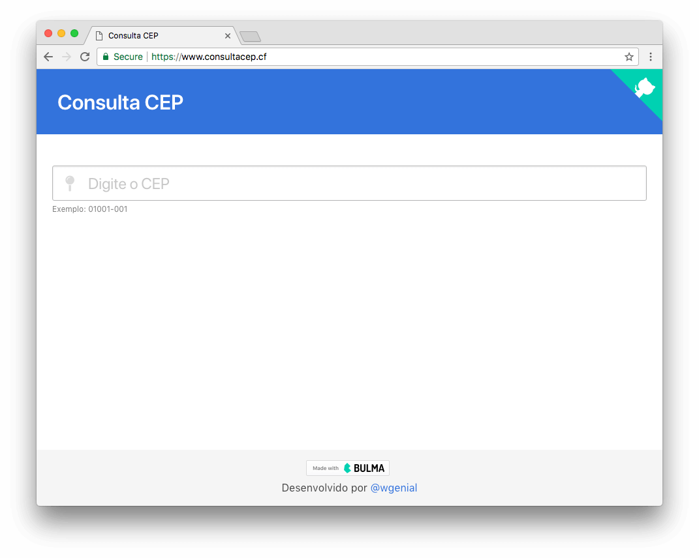
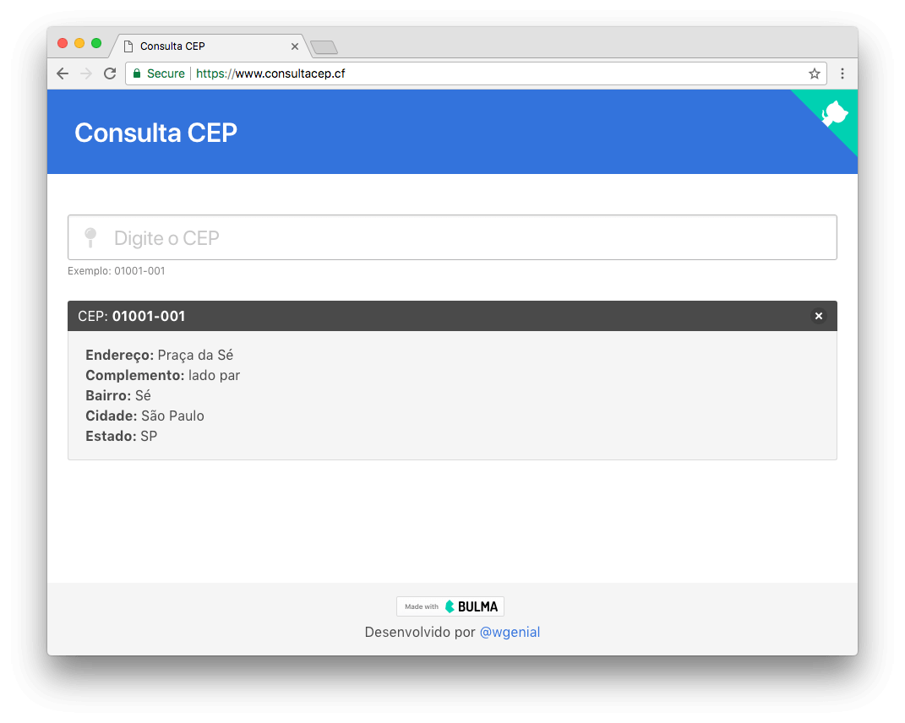
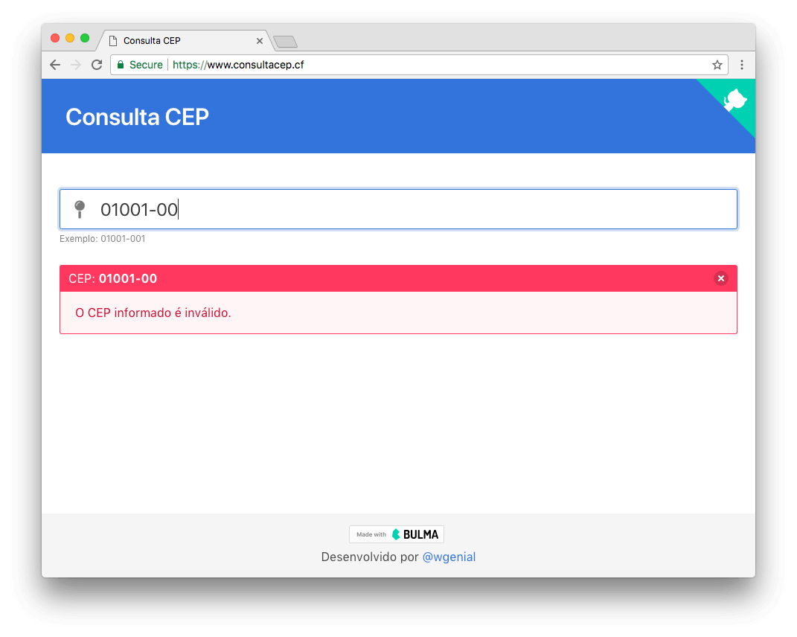
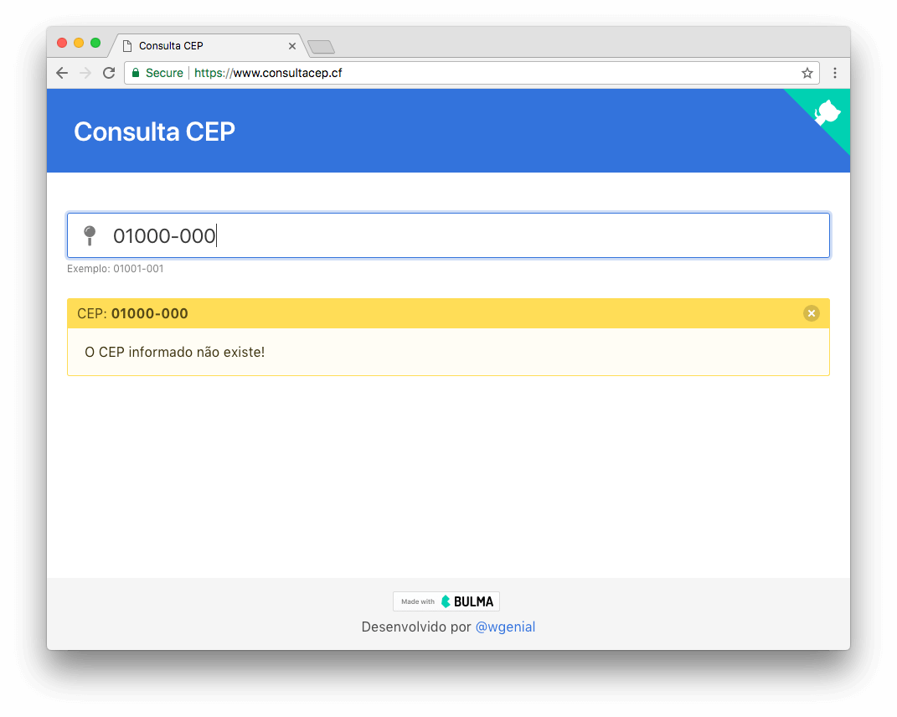
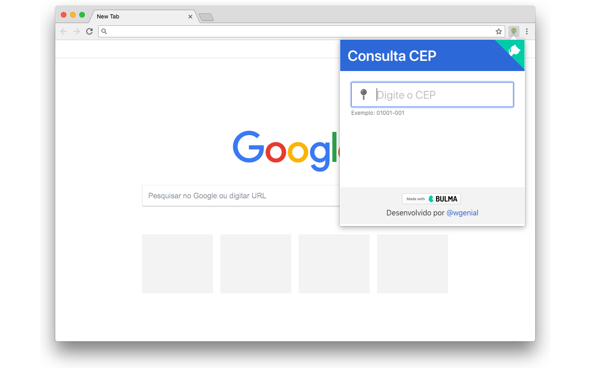
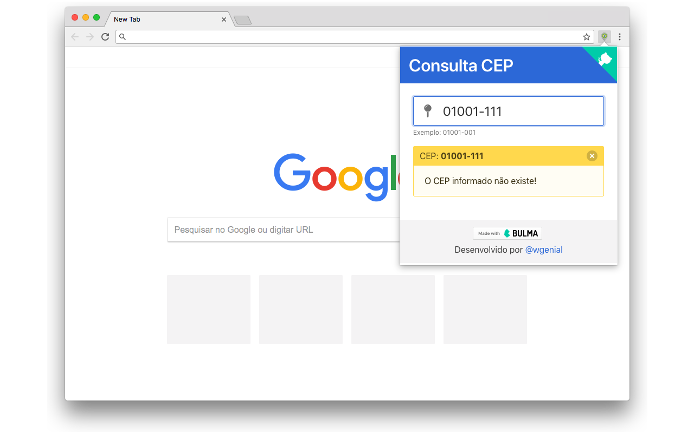

# ConsultaCEP

## Visão Geral
[https://consultacep.cf](https://consultacep.cf)

- Consulta CEP é uma aplicação básica para consulta de CEP.

- Foi construida com [javascript puro (vanilla)](https://developer.mozilla.org/en-US/docs/Web/JavaScript/Guide), sem dependências de frameworks.

- A consulta é feita utilizando [Fetch API](https://developer.mozilla.org/en-US/docs/Web/API/Fetch_API) diretamente na API [Via Cep](https://viacep.com.br).

- No CSS foi utilizado o framework [Bluma.io](https://bulma.io)

## Preview

# Chrome Extension

## Autores
* [@giovanigenerali](https://github.com/giovanigenerali)
* [@wgenial](https://github.com/wgenial)
